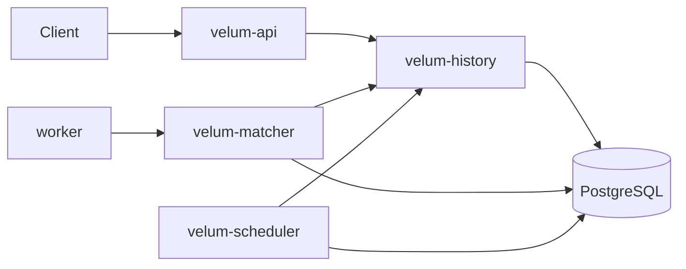

# Velum

Durable workflow orchestration platform in Go — event-sourced runs, task leasing, gRPC workers, timers, and idempotent completions.

**Module:** `github.com/0xrameshh/velum`

## Quick start (Docker)

Starts split control plane (`velum-history` `:9091`, `velum-api` `:8080`, `velum-matcher` `:9090`, `velum-scheduler`) plus workers on `default`, `email`, and `payments` queues.

```bash
docker compose up --build -d
make curl-start
sleep 1
make curl-status
```

### Timers demo (`delayed_greet`)

Workflow: `greet` → **sleep** (durable timer, no goroutine held) → `send_email`.

```bash
make curl-delayed-start
# wait for sleep_seconds (default 5) + activity time
make curl-delayed-status
```

Expect events: `TimerStarted` → `TimerFired` between greet and send_email.

## Local dev

**All-in-one** (fastest):

```bash
docker compose up -d postgres
make proto build
./bin/velum-migrate
./bin/velum   # API + gRPC + scheduler
./bin/velum-worker  # VELUM_TASK_QUEUE=default
VELUM_TASK_QUEUE=email VELUM_WORKER_ID=local-email ./bin/velum-worker
```

**Split binaries** (matches production Compose):

```bash
docker compose up -d postgres && make build && ./bin/velum-migrate
./bin/velum-history &
./bin/velum-api & ./bin/velum-matcher & ./bin/velum-scheduler &
make run-worker-default   # separate terminals for email/payments as needed
```

## API

| Method | Path | Description |
|--------|------|-------------|
| `GET` | `/health` | Liveness |
| `GET` | `/ready` | Readiness |
| `POST` | `/api/v1/namespaces/{ns}/workflows/{name}/start` | Start a workflow |
| `GET` | `/api/v1/namespaces/{ns}/runs/{run_id}` | Run + event history |

### Workflows

| Name | Steps |
|------|-------|
| `greet` | `greet` (default queue) → `send_email` (email queue) |
| `delayed_greet` | `greet` → timer (`sleep_seconds` in input) → `send_email` |
| `order_saga` | parallel `charge_card` + `reserve_stock` → `ship_order` → (on ship fail) compensate |

### Saga demo (`order_saga`)

Happy path:

```bash
make curl-saga-start
sleep 2
make curl-saga-status
```

Compensation path (ship fails, refunds/releases run):

```bash
make curl-saga-fail
sleep 3
make curl-saga-status
```

Input flags: `fail_charge`, `fail_reserve`, `fail_ship` (all simulated).

Input for `delayed_greet`:

```json
{"name": "Ramesh", "sleep_seconds": 5}
```

## gRPC WorkerService (`:9090`)

| RPC | Description |
|-----|-------------|
| `PollTask` | Lease next task on a queue |
| `RecordHeartbeat` | Extend lease while executing |
| `CompleteTask` | Idempotent completion |
| `FailTask` | Idempotent failure / retry |

Protos: `proto/velum/v1/worker.proto`, `proto/velum/v1/history.proto` — regenerate with `make proto`.

## HistoryService gRPC (`:9091`)

| RPC | Description |
|-----|-------------|
| `StartWorkflow` | Create run + schedule first step |
| `GetRun` | Run metadata + event history |
| `OnActivityCompleted` | Advance after task success |
| `OnActivityFailed` | Record failure event |
| `HandleTerminalFailure` | Fail workflow or start saga compensation |
| `OnTimerFired` | Advance after durable timer |

## Binaries

| Binary | Purpose |
|--------|---------|
| `velum-history` | Workflow state + event log (Postgres) |
| `velum-api` | HTTP API (history client only) |
| `velum-matcher` | gRPC task poll/complete/fail |
| `velum-scheduler` | Fire due timers |
| `velum-migrate` | Apply Postgres migrations (one-shot) |
| `velum-worker` | Execute activities |
| `velum` | All-in-one for local dev (`VELUM_ENABLE_*` flags) |

## Configuration

| Variable | Used by | Description |
|----------|---------|-------------|
| `VELUM_HTTP_ADDR` | api | HTTP listen (`:8080`) |
| `VELUM_GRPC_ADDR` | matcher, worker | Worker gRPC listen / dial |
| `VELUM_HISTORY_GRPC_ADDR` | history, api, matcher, scheduler | History gRPC listen / dial (`:9091`) |
| `VELUM_DATABASE_URL` | history, matcher, scheduler, migrate | PostgreSQL DSN |
| `VELUM_MIGRATE_ON_STARTUP` | history | Run migrations on boot (Compose uses `velum-migrate`) |
| `VELUM_SCHEDULER_POLL_EVERY` | scheduler | Timer poll interval |
| `VELUM_SCHEDULER_BATCH_SIZE` | scheduler | Max timers per tick |
| `VELUM_LEASE_RECLAIM_EVERY` | matcher | Reclaim expired task leases |
| `VELUM_TASK_QUEUE` | worker | Queue to poll |
| `VELUM_ENABLE_EMBEDDED_WORKER` | `velum` only | In-process DB poller (dev) |

## Architecture



## Roadmap

- [x] Phase 2: gRPC workers, queues, idempotency
- [x] Phase 3: Timers / sleep workflows
- [x] Phase 4: Parallel branches + saga compensation
- [x] Phase 5: Split control-plane binaries
- [x] Phase 6: History gRPC service
- [ ] Phase 7: Optional dispatch bus + scale-out

## License

MIT
